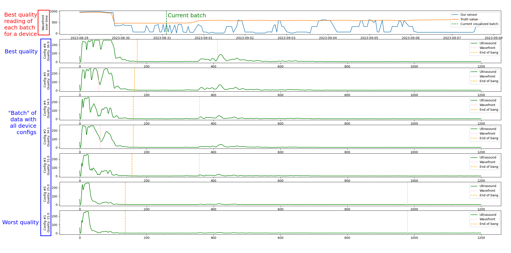

# Description
This is a small utility script to show our current algorithms running on a sample dataset. 

## Requirements
The required python packages are listed in `pyproject.toml` (I personally use poetry, but as long as the
packages are installed it should work). 

```
# With poetry
poetry install
# Or directly with pip:
pip install .
```

Run the script `main.py` to see a couple simple plots showing the results of the algorithm on some example 
batches that are more problematic:

```
python main.py
```

Here is an example output image from this script, with some explanations:


We can see for this device that the result of our algos (in blue in the top plot) often thinks that the silo is full (the wavefront is close to the initial bang), when the truth value in orange says otherwise. This is due to the low amount of signal that we get that is interpreted as noise by the algos.

## More info
There is more info about the algorithms in the `docs/` folder.
