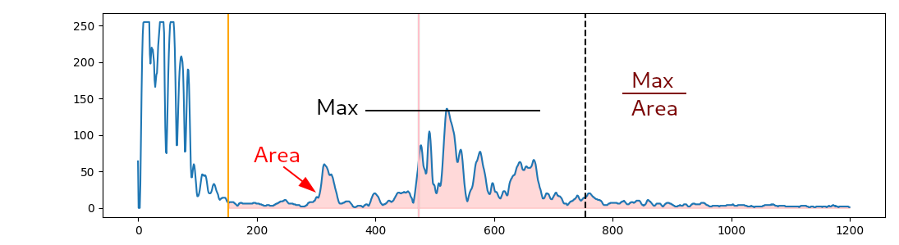

# Description des valeurs calculées
Plusieurs valeurs sont calculées pour chaque lecture reçue par tous les capteurs. Voici un exemple de lecture:

## Fin du bang
En orange, la fin du bang de l'envoi de l'onde ultrason afin de séparer l'envoi de la réponse.

La fin du bang est calculée en glissant une fenêtre de points et en calculant la moyenne de cette fenêtre. Lorsque la moyenne est sous un certain seuil, la fin du bang est détectée.

## Front d'onde
En rose, le front d'onde afin de trouver le pic principal qui correspond au retour de l'onde ultrason qui frappe la moulée dans le silo.

Le front d'onde est simplement le point auquel le signal est à la mi hauteur du maximum (le maximum excluant le bang du début). Par contre, comme il a été remarqué qu'il y a parfois un plus petit pic avant le pic principal du retour (qui dépend possiblement de la géométrie du silo ou bien de moulée qui serait restée collé),
seulement une fenêtre d'une certaine largeur autour du maximum est considérée afin d'ignorer ces plus petits pics qui peuvent faire "accroché" le front d'onde trop tôt.

## Qualité de l'onde
On veut avoir une idée de la qualité des ondes que l'on reçoit. Par exemple une onde de bonne et moins bonne qualité:

Une onde de bonne qualité a un pic principal plus clair, alors qu'une onde de moins bonne qualité a moins un pic clair et peut avoir plusieurs pics et avoir un profil beaucoup plus large.

Pour calculer la qualité, on prend donc principalement le max de l'onde que l'on divise par l'aire sous la courbe, ce qui donne une qualité élevé lorsque le pic est grand et étroit, et une qualité basse lorsqu'il n'y a pas de haut pic et que le signal est très large.

